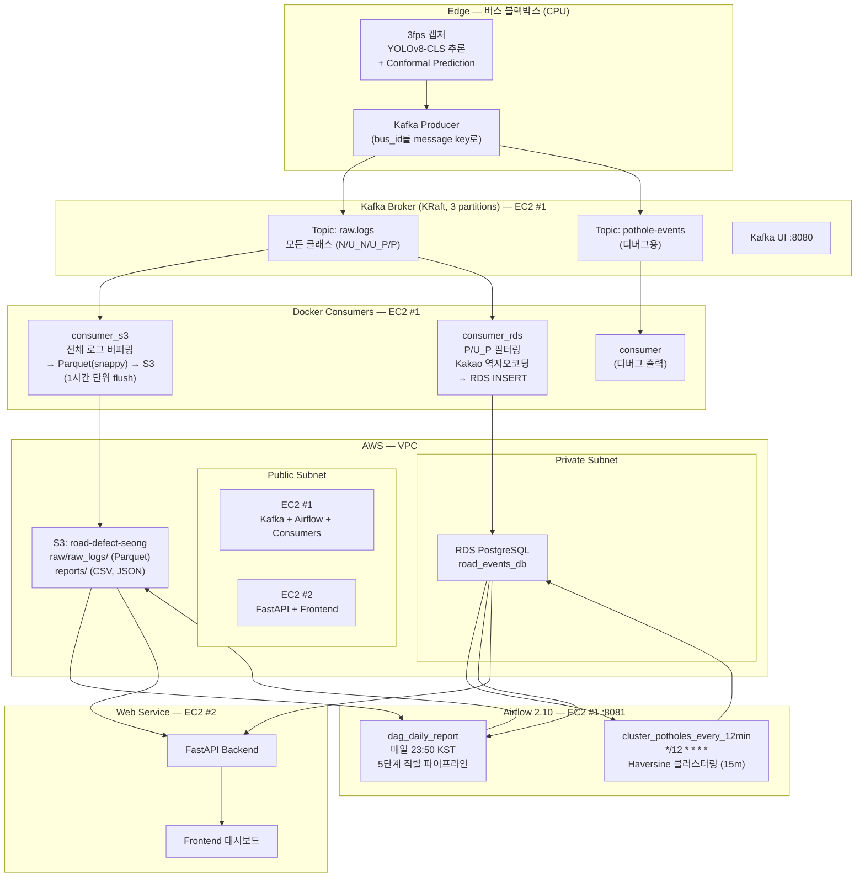

# 도로 진단 서비스 — 실시간 포트홀 관리 파이프라인

> SK Planet 생성형AI 활용 데이터엔지니어 과정 2기 | 주대성 · 성효창

버스 블랙박스에 탑재된 YOLOv8 모델이 실시간으로 노면 결함을 감지하고,  
Kafka → Consumer → RDS/S3 → Airflow 파이프라인을 통해 포트홀 클러스터를 자동 집계·시각화하는 데이터 엔지니어링 프로젝트입니다.

---

## 문제 정의

기후 변화로 인한 폭우·폭설 반복으로 포트홀 발생이 급증하고 있습니다.

| 지표 | 수치 |
|---|---|
| 서울시 포트홀 발생 건수 (3년 7개월) | **19,000건** |
| 포트홀 사고 배상금 (2020→2024) | **3배 증가, 누적 41억 원** |
| 기존 AI 탐지 시스템 오탐률 | **85%** (517건 중 실제 보수 필요 14.7%) |
| 현장 직원 미사용률 | **73%** (연간 12억 원 투입에도) |

→ 신뢰할 수 있는 데이터 파이프라인과 불확실성을 명시하는 모델 구조가 필요합니다.

---

## 핵심 차별점

| | 기존 시스템 | 본 프로젝트 |
|---|---|---|
| 분류 방식 | 단순 확률 임계값 | Conformal Prediction (신뢰구간 90%) |
| 오버컨피던스 | 높음 (오탐 85%) | 통계적 보정으로 억제 |
| 데이터 활용 | 탐지 결과만 저장 | 전체 원시 로그 → Data Lake (HNM 재학습) |
| 포트홀 중복 처리 | 없음 | Haversine 클러스터링 (반경 15m) |

---

## 시스템 아키텍처



---

## 데이터 스키마 흐름

### 1. Kafka 메시지 (JSON) — `raw.logs` 토픽

버스 블랙박스가 매 프레임(3fps)마다 발행합니다.  
`event_id`에 구역·버스·회차·날짜 정보를 내포해 파티션 키, 중복 제거, 디버깅에 활용합니다.

```json
{
  "event_id":           "bus42-first-20260504-001042",
  "frame_id":           1042,
  "timestamp":          "2026-05-04T13:22:01.123Z",
  "source":             "cam_front",
  "run_id":             "first",
  "bus_id":             "bus-42",
  "direction":          "forward",

  "prob_normal":        0.12,
  "prob_pothole":       0.87,
  "confidence":         0.87,
  "cp_class":           3,
  "cp_class_name":      "P",
  "inference_time_ms":  18.4,

  "gps_lat":            37.4563,
  "gps_lng":            126.7052,
  "speed_kmh":          24.5
}
```

**CP Class — Conformal Prediction 4단계 분류**

| cp_class | cp_class_name | 의미 | 파이프라인 처리 |
|:---:|:---:|---|---|
| 0 | N | 정상 노면 | S3 보존 (재학습 데이터) |
| 1 | U_N | 불확실 — 정상 추정 | S3 보존 + HNM 후보 추출 |
| 2 | U_P | 불확실 — 포트홀 추정 | RDS 즉시 적재 + S3 + HNM |
| 3 | P | 포트홀 확정 | RDS 즉시 적재 + S3 |

---

### 2. S3 Parquet — 원시 로그 Data Lake (`consumer_s3`)

`raw.logs`의 **전체 메시지**를 인메모리 버퍼에 쌓다가 **1시간마다** Parquet(snappy)으로 변환해 S3에 업로드합니다.  
JSON 파싱 실패 메시지도 `parse_error=True`로 보존해 유실을 방지합니다.

```
s3://road-defect-seong/
├── raw/raw_logs/
│   └── year=2026/month=05/day=04/hour=22/
│       └── part-<uuid>.parquet          ← Hive 파티셔닝
└── reports/
    └── 2026-05-04/
        ├── task3_hnm_candidates.csv
        └── summary.json
```

**Parquet 스키마**

| 컬럼 | 타입 | 설명 |
|---|---|---|
| event_id | string | 이벤트 고유 ID |
| frame_id | int64 | 카메라 프레임 번호 |
| timestamp | string | 촬영 시각 (UTC ISO8601) |
| source / run_id / bus_id / direction | string | 운행 메타데이터 |
| prob_normal / prob_pothole / confidence | float64 | 모델 출력 확률 |
| cp_class | int64 | 분류 코드 (0~3) |
| cp_class_name | string | N / U_N / U_P / P |
| inference_time_ms | float64 | 프레임당 추론 소요 시간 (ms) |
| gps_lat / gps_lng | float64 | WGS84 좌표 (실제 버스 노선 기반) |
| speed_kmh | float64 | 버스 속도 |
| kafka_topic / kafka_partition / kafka_offset | string/int | Kafka 메타 |
| ingested_at | string | S3 적재 시각 (KST) |
| parse_error | bool | JSON 파싱 실패 여부 |

---

### 3. RDS PostgreSQL — 서비스·시각화 전용 (`consumer_rds`)

`raw.logs`에서 `cp_class_name IN ('P', 'U_P')` 이벤트만 필터링한 뒤  
Kakao Local API로 GPS → 도로명 주소 역지오코딩 후 삽입합니다.

**road_defect_events** — Kafka Consumer가 긴급 적재

| 컬럼 | 타입 | 설명 |
|---|---|---|
| event_id | VARCHAR PK | `ON CONFLICT DO NOTHING` |
| event_timestamp | TIMESTAMPTZ | 촬영 시각 |
| gps_lat / gps_lng | NUMERIC | GPS 좌표 |
| cp_class / cp_class_name | INT/VARCHAR | P 또는 U_P |
| road_address | VARCHAR | Kakao 역지오코딩 도로명 주소 |
| is_clustered | INT | 클러스터링 완료 여부 (0/1) |
| cluster_id | VARCHAR FK | 소속 클러스터 ID |
| clustered_at | TIMESTAMPTZ | Airflow 클러스터링 처리 시각 |

**road_defect_clusters** — Airflow DAG가 12분 주기 갱신

| 컬럼 | 타입 | 설명 |
|---|---|---|
| cluster_id | VARCHAR PK | `cluster_YYYYMMDDHHMMSS_<8hex>` |
| representative_event_id | VARCHAR | 최초 이벤트 ID |
| first_event_timestamp | TIMESTAMPTZ | 최초 탐지 시각 |
| last_event_timestamp | TIMESTAMPTZ | 최근 탐지 시각 |
| gps_lat / gps_lng | NUMERIC | 클러스터 대표 좌표 |
| cp_class / cp_class_name | INT/VARCHAR | 분류 |
| road_address | VARCHAR | Kakao 도로명 주소 (클러스터 생성 시 1회 호출) |
| detection_count | INT | 누적 탐지 횟수 |
| is_repaired | INT | 수리 완료 여부 (0/1) |
| created_at / updated_at | TIMESTAMPTZ | 생성·수정 시각 |

---

## Airflow DAGs

### DAG 1: `cluster_potholes_every_12min`

```
스케줄: */12 * * * *  (버스 평균 배차 간격 기준)
```

RDS `road_defect_events`에서 미클러스터링 P/U_P 이벤트를 최대 5,000건씩 읽어  
**Haversine 거리 15m** 기준으로 기존 클러스터에 병합하거나 신규 클러스터를 생성합니다.

```
cluster_pothole_events
  ├── 미클러스터링 이벤트 조회 (is_clustered=0, LIMIT 5000)
  ├── 기존 미수리 클러스터 조회 (is_repaired=0)
  └── 이벤트별 처리
       ├── [15m 이내 클러스터 존재] detection_count +1 / last_event_timestamp 갱신
       └── [신규] Kakao API 역지오코딩 → road_defect_clusters INSERT
```

> Classification 모델 특성상 동일 포트홀이 연속 프레임에서 다중 탐지되므로,  
> 반경 15m 이내 이벤트를 단일 클러스터로 병합해 중복을 제거합니다.  
> 향후 Segmentation 모델 도입 시 정밀 위치 분류로 확장 가능합니다.

---

### DAG 2: `dag_daily_report`

```
스케줄: 50 23 * * *  (매일 23:50 KST — 막차 운행 종료 후)
실패 시: 5분 간격 2회 재시도
```

5개 태스크가 직렬 실행되어 S3에 일일 리포트를 저장합니다.

```
t1: model_performance_monitoring
    S3 Parquet 로드 → 회차(run_id)별 평균 추론시간 + CP 클래스 분포 집계
    ↓
t2: speed_uncertainty_analysis
    속도 구간별(0~10 / 10~20 / 20~30 / 30+km/h) 불확실 예측(U_N+U_P) 비율 분석
    ↓
t3: hnm_candidates_extraction
    U_N(cp_class=1) / U_P(cp_class=2) 전체를 HNM 후보 CSV로 S3 저장
    → s3://.../reports/{date}/task3_hnm_candidates.csv
    ↓
t4: pothole_cluster_report
    RDS 클러스터 일일 집계 (당일 신규 / 전체 / 미수리 / 수리 완료 건수)
    + 전일 대비 증감률 계산 (XCom으로 t5에 전달)
    ↓
t5: generate_daily_summary
    Task 1~4 결과 취합 → summary.json → S3
    → s3://.../reports/{date}/summary.json
```

---

## 프로젝트 구조

```
pothole-airflow-kafka/
├── docker-compose.yml            # 전체 서비스 정의 (Kafka, Airflow, 3 Consumers)
│
├── consumer/                     # 디버그 Consumer (pothole-events 토픽)
│   ├── Dockerfile
│   ├── consumer.py
│   └── requirements.txt          # confluent-kafka
│
├── consumer_rds/                 # P/U_P 필터링 → RDS Consumer
│   ├── Dockerfile
│   ├── consumer_rds.py           # Kakao 역지오코딩 + PostgreSQL INSERT
│   └── requirements.txt          # confluent-kafka, psycopg2-binary, requests
│
├── consumer_s3/                  # 전체 로그 → S3 Parquet Consumer
│   ├── Dockerfile
│   ├── consumer_s3.py            # 배치 버퍼 → Parquet(snappy) → S3
│   └── requirements.txt          # confluent-kafka, boto3, pandas, pyarrow
│
└── airflow/
    └── dags/
        ├── cluster_potholes_12min_dag.py   # 12분 클러스터링 DAG
        └── dag_daily_report.py             # 일일 리포트 DAG (5 tasks)
```

---

## Tech Stack

| 컴포넌트 | 기술 |
|---|---|
| AI 모델 | YOLOv8-CLS + Conformal Prediction (신뢰구간 90%) |
| Message Broker | Apache Kafka 4.1.2 (KRaft, 3 partitions) |
| Consumer | Python + confluent-kafka 2.6.1 |
| Orchestration | Apache Airflow 2.10.5 (SequentialExecutor) |
| Storage — Raw | AWS S3 (Parquet, snappy, Hive 파티셔닝) |
| Storage — Events | AWS RDS PostgreSQL (t3.small) |
| Backend | FastAPI (EC2 #2) |
| Geocoding | Kakao Local API (GPS → 도로명 주소) |
| Containerization | Docker Compose (bridge network `pipeline-net`) |
| Monitoring | Kafka UI (provectuslabs/kafka-ui) |
| Infra | AWS VPC / EC2 2대 / RDS (Private Subnet) |

---

## Quick Start

### 사전 요구사항

- Docker & Docker Compose
- AWS 자격증명 (S3, RDS 접근 권한)
- Kakao REST API Key

### 환경 변수 설정

```bash
cp .env.example .env
```

```dotenv
EC2_PUBLIC_IP=<EC2 퍼블릭 IP 또는 localhost>

DB_HOST=<RDS 엔드포인트>
DB_PASSWORD=<DB 패스워드>

AWS_DEFAULT_REGION=ap-northeast-1
S3_BUCKET=road-defect-seong

KAKAO_REST_API_KEY=<카카오 REST API 키>
```

### 실행

```bash
docker compose up -d
```

| 서비스 | URL |
|---|---|
| Kafka UI | http://localhost:8080 |
| Airflow Webserver | http://localhost:8081 (admin / admin) |

### Airflow DAG 활성화

```bash
docker exec airflow airflow dags unpause cluster_potholes_every_12min
docker exec airflow airflow dags unpause dag_daily_report
```

---

## 핵심 설계 결정

**이중 Consumer (S3 + RDS)**  
동일 `raw.logs` 토픽을 별도 Consumer Group으로 구독합니다. S3에는 전체 원시 로그를, RDS에는 P/U_P 결함 이벤트만 저장해 각 저장소의 목적에 맞는 스키마를 유지합니다.

**S3 배치 flush (1시간)**  
매 메시지를 S3에 업로드하면 PUT 요청 비용이 급증합니다. 인메모리 버퍼에 쌓은 뒤 1시간 단위로 Parquet 단일 파일로 업로드하고, 업로드 성공 후에만 오프셋을 커밋합니다.

**Haversine 클러스터링 (15m 반경)**  
Classification 모델 특성상 동일 포트홀이 연속 프레임에서 다중 탐지됩니다. 기존 클러스터 15m 이내에 새 이벤트가 들어오면 `detection_count`만 증가시키고 신규 클러스터 생성을 억제해 중복을 방지합니다.

**HNM(Hard Negative Mining) 후보 추출**  
불확실 클래스(U_N/U_P)는 모델이 판단을 유보한 케이스입니다. 일일 리포트에서 이를 CSV로 자동 추출해 재학습 데이터셋 구축 루프에 연결합니다.

**12분 DAG 스케줄**  
버스 평균 배차 간격(12분)에 맞춰 클러스터링 DAG를 실행해 시각화 데이터를 항상 최신 상태로 유지합니다.

---

## MLOps 설계

```
[모델 개발]          [배포]              [모니터링]           [재학습 데이터 수집]
YOLOv8-CLS       로컬 블랙박스 환경    inference_time_ms    HNM 후보 자동 추출
+ Conformal      실제 추론 파이프라인  전수 기록            (DAG 2 - Task 3)
  Prediction     연결 완료             cp_class 분포 추적
(사전 프로젝트)                        confidence 추적      S3 Parquet Data Lake
                                                            → 재학습 기준 변경 시
                                                              언제든 재처리 가능
```

---

## 확장 방향

- **노선 확장**: 13개 시뮬레이션 노선 → 서울시 전체 250개 노선 (Kafka Consumer 수평 확장)
- **이벤트 다양화**: 판스프링·낙하물·배수 불량·도로 균열 등 실시간 이벤트 추가
- **모델 고도화**: CP 기법을 Segmentation 모델에 도입해 포트홀 면적·깊이 정밀 분류
- **CI/CD 자동화**: Bastion Host / GitHub Actions 기반 자동 배포 파이프라인
- **운영 모니터링**: Grafana 대시보드 구축, 고가용성(Kafka 클러스터, AZ, EC2 오토스케일러)
- **Human-in-the-loop**: HNM 후보 자동 추출 → 반자동 라벨링 → 재학습 파이프라인 연동
